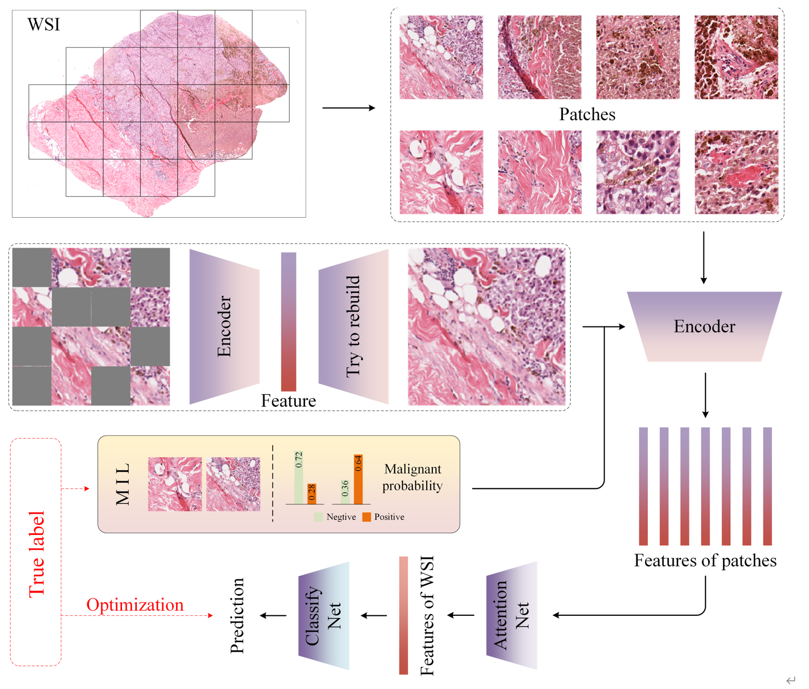

  

The official implementation of the paper A Novel Feature Extraction Enhanced Multiple Instance Learning Method for Melanoma Image Classification

# Abstract
Digital pathology has revolutionized cancer diagnosis by transitioning from traditional microscopic examination to the analysis of whole slide images (WSIs). This paper focuses on the application of computer-aided diagnosis systems in the detection of skin melanoma, a cancer with a significant impact on younger demographics and a sharp drop in survival rates upon metastasis. We propose a novel Feature Extraction Enhanced Multiple Instance Learning (Fee-MIL) approach to address the challenges associated with the digital transition in pathology, particularly the scarcity of annotated datasets and the large size of WSIs. Our methodology combines weakly supervised learning and self-supervision learning to enhance the recognition of tumor patches within WSIs. By employing a dual-channel feature extraction enhancement mechanism, our model significantly improves the identification of malignant tumor patches, leading to more accurate classification outcomes. The Fee-MIL model is evaluated on the TCIA-CM dataset and compared with several state-of-the-art algorithms, demonstrating superior performance in melanoma WSI classification.
